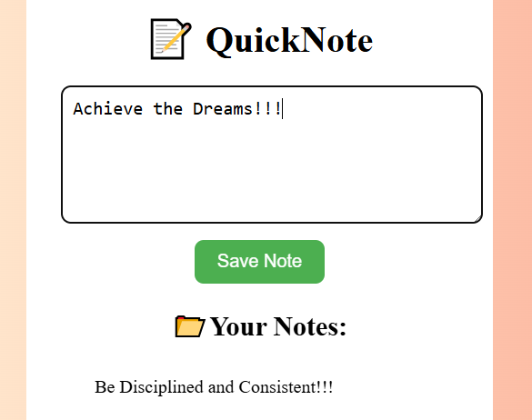

📝 QuickNote – Note Taking App
QuickNote is a simple and clean web-based note-taking app where users can jot down thoughts, reminders, or ideas and instantly see them listed. It's fast, lightweight, and perfect for daily journaling or brain dumps.

📌 Features
Add and save notes instantly

User-friendly interface

Smooth gradient background for clean visuals

Notes display dynamically as you add them

🛠️ Tech Tools Used
Tool	Meaning
HTML	Structure of the app (skeleton of the page)
CSS	Styling – colors, fonts, spacing, and layout
JavaScript	Logic and interaction (saving notes, DOM updates)

📷 Preview
Insert a screenshot here if uploading to GitHub repo

🚀 How to Use
Type your note in the input area.

Click the "Save Note" button.

The note will appear under "Your Notes" section.

## 📷 Screenshot

